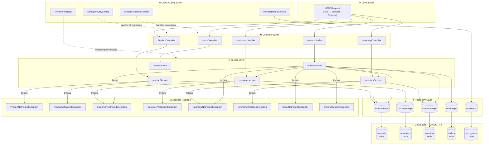
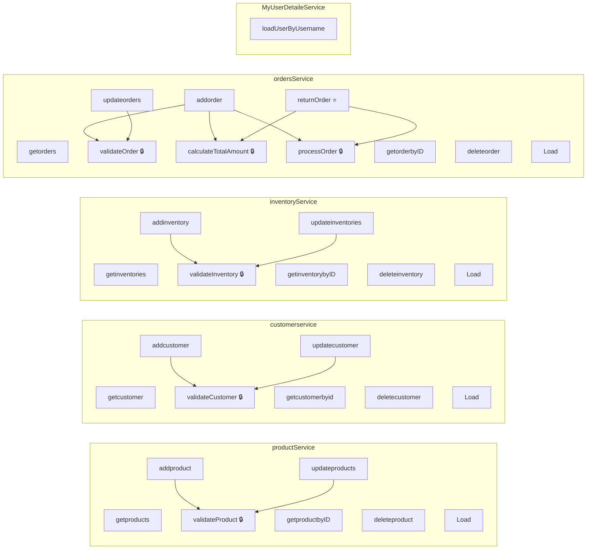
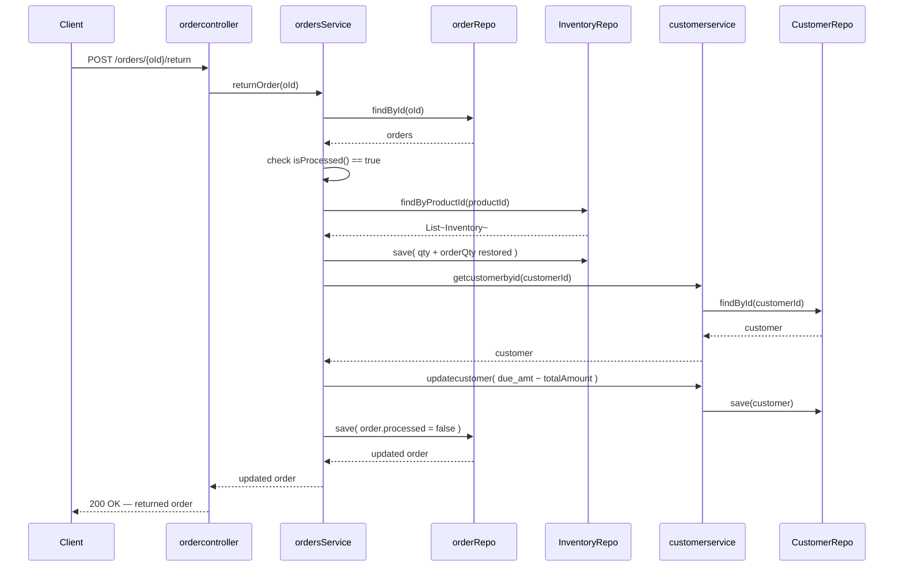
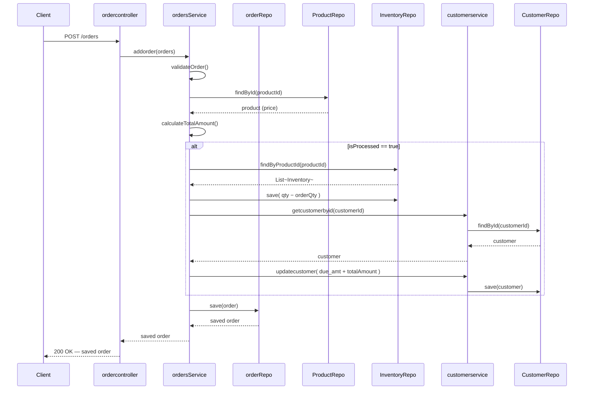
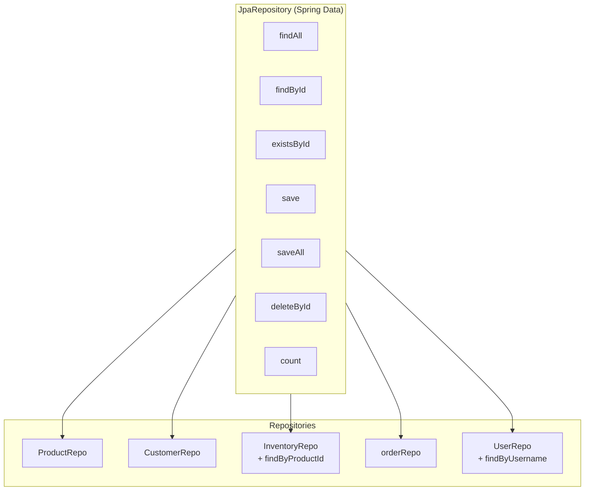
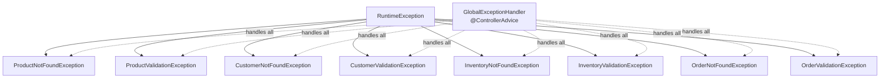

# Hardware Application — System Architecture

---

## 1. System Architecture Overview

---

## 2. Service Layer — Methods Detail

---

## 3. Return Order Flow

---

## 4. Add Order Flow

---

## 5. Repository Layer

---

## 6. Exception Hierarchy

---

## 7. Validation Strategy

| Service               | Validate Method          | Exceptions Thrown                                                                               |
|-----------------------|--------------------------|-------------------------------------------------------------------------------------------------|
| `productService`      | `validateProduct()`      | `ProductValidationException`, `ProductNotFoundException`                                        |
| `customerservice`     | `validateCustomer()`     | `CustomerValidationException`, `CustomerNotFoundException`                                      |
| `inventoryService`    | `validateInventory()`    | `InventoryValidationException`, `InventoryNotFoundException`                                    |
| `ordersService`       | `validateOrder()`        | `OrderValidationException`, `OrderNotFoundException`, `CustomerNotFoundException`, `InventoryNotFoundException` |
| `MyUserDetaileService`| Spring Security          | `UsernameNotFoundException`                                                                     |
| `usersService`        | *(in-memory, no DB)*     | —                                                                                               |

